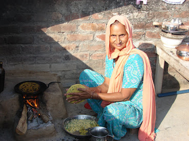

Today morning while Ranit and I were on our way to Ranit's bus stop, he was telling about how disgusting it was to see cow dung lying around in a farm house that he visited with his classmates sometime back during a school trip. He couldn't make sense of people making cow dung cakes with bare hands. That made me realize how the time has changed and how much fun it used to be for me when I was his age doing the same things that he finds disgusting.

### Flashback to late 1980s:

It was a nice sunny day and I was at my maternal grandmothers house in a village called "Pandori Bhainsa Di" which is about 15 KM from the nearest town Dinanagar in Punjab. 

Naani(Grandmother) was preparing for some guests or for some festival that was around the corner. I don't remember the exact occasion but what it meant for us was that entire house needed to be cleaned, sanitised and decorated. It was a [kachha house](https://www.google.co.in/search?q=kachha+house&espv=2&biw=1622&bih=892&source=lnms&tbm=isch&sa=X&ei=Hd5-VPTBA4y9uATyzYLgAQ&ved=0CAYQ_AUoAQ).

First step of the preparation was to gather a lot of fresh cow dung and bring it home and it meant going to people's houses in the neighbourhood and collect hot & fresh cow dung from their cattel sheds. It felt like a social trip to everyones house. Next step was to add a little water in this collection of cow dung and mix it up with hands or feet until everything mixes up perfectly and a uniform paste is ready. This was followed up with pasting of the paste on entire kachha floor of the house.

The paste dried out in an hour and the house started looking as good as new. It was so much fun doing all that and being part of this sanitising process. 

### Another incident from around the same time:

I was hungry and wanted something to eat but the [Chullah](https://www.google.co.in/search?q=chullah&espv=2&biw=1622&bih=892&source=lnms&tbm=isch&sa=X&ei=SPR-VLfsM4KbuQSHxoKIAw&ved=0CAYQ_AUoAQ) was not setup for cooking yet. On repeated requests, my granny asked me to get some fire from the neighbours and some dry cow dung cakes from the store on the roof. 

what!!! Yes thats right. Get fire from the neighbours was what she asked to me do. 

What could that possibly mean? and how was I suppose to get the fire from neighbour's house? She handed me an iron [Chimta](https://www.google.co.in/search?q=chullah&espv=2&biw=1622&bih=892&source=lnms&tbm=isch&sa=X&ei=SPR-VLfsM4KbuQSHxoKIAw&ved=0CAYQ_AUoAQ#tbm=isch&q=chimta) and told me that the neighbour will understand and that I am good to go. 

On my way I was still thinking about how would I ask for fire and what is naani (Granny) going to do with it. Nevertheless I went ahead and was shortly in our neighbour's open kitchen where they were already cooking evening meal. I asked hesitantly "Maamy ji, Naani ne aag mangayi hai" (Naani has asked for some fire).  Maamy pulled me into her laps and showered me with a few kisses, took the Chimta from my hand and pulled a piece of burning wood from her chullah and gave it to me. She also asked me to be careful with it on my way back.

Thats it. It was so simple. Everybody in the village understood the process and sharing everything including fire from Chullah was a custom being followed in the village since the time that nobody knew about.

On further probing I learnt that during old times starting fire used to be a tough task and it used to take quite some time and effort to do it. So people used to take turns to start the fire and once it was on, every house in the village would share this fire with the neighbouring houses. 

Now in 1980s, even though matchsticks were available it was still more convenient to get a burning piece of wood from neighbour's than to light a match and get the Chullah stuffed with cow dung cakes and wood hot for making chapattis.  

### Back to present:

At the bus stop, I narrated these two incidents to my son and by that time the school bus also arrived. I knew he had several followup questions but boarded the bus probably visualising what I had just told him.
