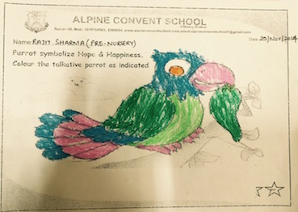

 Last Friday, I got a text message from a school in Gurgaon to collect an appreciation gift for my younger son who won the first prize in a colouring contest that they held at their school and where several schools from Gurgaon participated.

First prize??? That can’t be true, at least genetically, I thought. I never got a first prize in my life. But I had seen Rajit scribbling on and ruining the walls of our drawing room a few times and knew that he had it in him :-) and now with this acknowledgement of his talent I can rest assured that my 3 and half year old is on his way to become India's Van Gogh. Unless education ruins him he can very well become Van Gogh. At least in his father's eyes he already is. 

Anyways, I called back to confirm if it was **Rajit Sharma** son of **Sanjeev Kumar** and they confirmed that it was indeed my younger one. 

Last week being a terrible one at work with yearend appraisals and all being done and me getting my share of peanuts, this news was a wonderful one to end the week. It put everything related to job, promotion, increments etc to the back burner, at least for the weekend and made me feel very happy and proud. Proud of you fr saving my weekend my Van Gogh. 

I can now also relate to the expressions and the feelings that my dad must have felt on our way back from my school in a convertible army Jeep 30+ years back. That day our annual results were announced and I came third in my class. I was in 1st standard and that was the closest I ever got to the first position.

I must admit that fatherhood is an amazing experience and teaches a lot, that otherwise is imposible to feel and learn. These little moments are all that make life so interesting and full.
